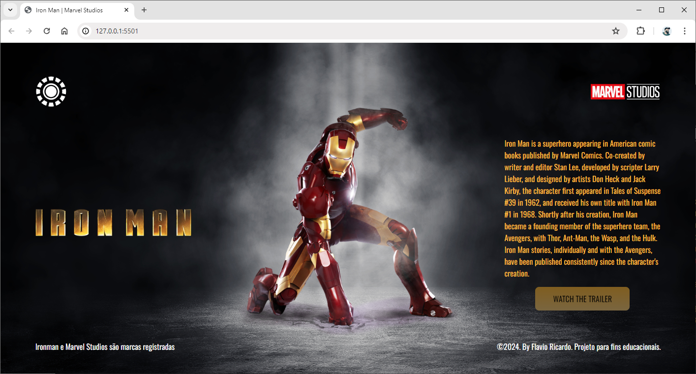

# Desafio Landing Page

## O que é uma Landing Page?
Uma **Landing Page** (também conhecida como LP), é uma página de aterrissagem, ou seja, um destino para o qual o usuário é encaminhado quando clica em um anúncio ou oferta.
As Landing Pages são muito utilizadas em campanhas publicitárias na internet, principalmente como destinos dos anúncios veiculados nas redes sociais.

## Como é a estrutura de uma Landing Page?
Uma **Landing Page** normalmente é composta por uma única página, contendo todas as informações do produto ou serviço que aprsenta e uma **CTA** *(Call to Action)*, ou *Chamada para Ação*, que geralmente é um botão com a funcionalidade de realizar uma compra ou download de conteúdo.

## Atividade: Produzir uma Landing Page
Nesta atividade, vamos desenvolver uma landing page simples, utilizando como tema um filme, série, animação, desenho ou anime à sua escolha.
O layout deve ser semelhante ao modelo da imagem abaixo:
 
### Elementos da Landing Page
A Landing Page deve conter:
- Imagem de fundo, relacionada ao tema;
- Header com:
    - Botão de menu (não requer funcionalidade, apenas deve indicar que há um botão)
- Main (conteúdo principal) com:
    - Logo do tema selecionado;
    - Imagem;
    - Texto descritivo;
    - Botão CTA (Call to Action), direcionando para o site oficial ou trailer oficial;
- Footer com:
    - Informações simples de rodapé;
### Como desenvolver?
Desenvolva a Landing Page utilizando HTML e CSS.
As imagens do tema selecionado pode ser obtidas me pesquisas no Google ou nos sites oficiais (conforme tema selecionado).
Para editar as imagens (caso seja necessário), utilize o [Photopea](https://photopea.com).
Crie a estrutura de pastas padrão para o projeto.
Utilize apenas um arquivo CSS.
### Entrega
O projeto deve ser enviado a um repositório público do GitHub, onde também será configurada uma GitPage.